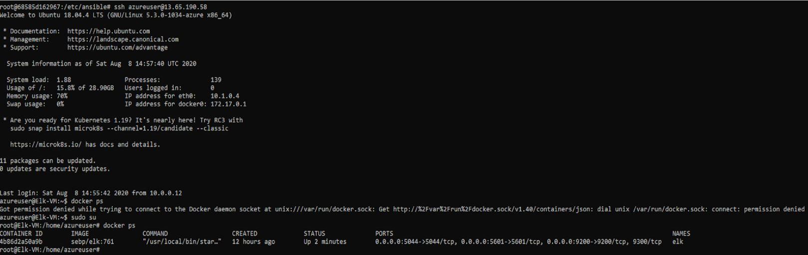

## Automated ELK Stack Deployment

The files in this repository were used to configure the network depicted below.

# Diagram 

# Project 1 screenshots 

These files have been tested and used to generate a live ELK deployment on Azure. They can be used to either recreate the entire deployment pictured above. Alternatively, select portions of the __install-elk.yml__ playbook file may be used to install only certain pieces of it, such as Filebeat.

This document contains the following details:
- Description of the Topologu
- Access Policies
- ELK Configuration
  - Beats in Use
  - Machines Being Monitored
- How to Use the Ansible Build

### Description of the Topology

The main purpose of this network is to expose a load-balanced and monitored instance of DVWA, the D*mn Vulnerable Web Application.

Load balancing ensures that the application will be highly __distributed__, in addition to restricting __access__ to the network.
- _What aspect of security do load balancers protect? What is the advantage of a jump box?_
   - __Load balancers distribute traffic defend against DDoS attacks and helps protect the avaliblities of the virtual machines.__
   - __A jump box helpts to provides admin security for when you are configuring your virtual machines and reduces the risk of threat.__

Integrating an ELK server allows users to easily monitor the vulnerable VMs for changes to the __files__ and __system__ logs.
- _What does Filebeat watch for?_
  - __Filebeat monitors the log files or locations that you specify and collects log events.__

- _What does Metricbeat record?_
  -  __Metricbeat periodically collect metrics from the operating system and from services running on the server.__

The configuration details of each machine may be found below.
_Note: Use the [Markdown Table Generator](http://www.tablesgenerator.com/markdown_tables) to add/remove values from the table_.

| Name     |  Function  | IP Address | Operating System |
|----------|------------|------------|------------------|
| Jump Box | Gateway    | 10.0.0.12  | Linux            |
| Web 1    | Server     | 10.0.0.10  | Linux            |
| Web 2    | Server     | 10.0.0.11  | Linux            |
| Elk      | Log-server | 10.1.0.4   | Linux            |

### Access Policies

The machines on the internal network are not exposed to the public Internet. 

Only the __Jump Box__ machine can accept connections from the Internet. Access to this machine is only allowed from the following IP addresses:
- _TODO: Add whitelisted IP addresses_
  - __The whitelisted IP addresses are my personal home IP address 73.232.131.41__

Machines within the network can only be accessed by __jump box__.
- _Which machine did you allow to access your ELK VM? What was its IP address?_
  - __Jump Box. The jump box Private IP 10.0.0.12__

A summary of the access policies in place can be found in the table below.

| Name          | Publicly Accessible | Allowed IP Addresses     |
|---------------|---------------------|--------------------------|
| Jump Box      | Yes                 | My home IP 73.232.131.41 |
| Web 1         | No                  | 10.0.0.12                |
| Web 2         | No                  | 10.0.0.12                |
| Elk           | No                  | My home IP 73.232.131.41 |

### Elk Configuration

Ansible was used to automate configuration of the ELK machine. No configuration was performed manually, which is advantageous because... __reduces user error and you can use the jump box to install and configure all the machines instead of having to ssh into all of them.__

TODO: What is the main advantage of automating configuration with Ansible?_
- __The main advantage is that you can have put commands into mutiple servers from a single playbook__

The playbook implements the following tasks:

In 3-5 bullets, explain the steps of the ELK installation play. E.g., install Docker; download image; etc._
- __Install docker.io__
- __Install python-pip__
- __Install docker__
- __Sysctl module to expand/use more memory__
- __Download and launch the docker container Elk__

The following screenshot displays the result of running `docker ps` after successfully configuring the ELK instance.

### Target Machines & Beats
This ELK server is configured to monitor the following machines:
- _TODO: List the IP addresses of the machines you are monitoring_
  - __Web 1 - 10.0.0.10__
  - __Web 2 - 10.0.0.11__

We have installed the following Beats on these machines:
- _TODO: Specify which Beats you successfully installed_
  - __Filebeat__
  - __Merticbeat__

These Beats allow us to collect the following information from each machine:
- _TODO: In 1-2 sentences, explain what kind of data each beat collects, and provide 1 example of what you expect to see. E.g., `Winlogbeat` collects Windows logs, which we use to track user logon events, etc._
  - __Filebeat is used to track and collect log data. Some of the logs it can track and collect are things like server logs and ssh logins.__
  - __Metricbeat is used to collect metrics from the system. It takes these metrics and statistics and ships them to where you want, such as Logstash or Elasticsearch.__

### Using the Playbook
In order to use the playbook, you will need to have an Ansible control node already configured. Assuming you have such a control node provisioned: 

SSH into the control node and follow the steps below:
- Copy the __configuration__ file to the __/etc/ansible/__.
- Update the __host line in the configuration__ file to include the __Elk IPs__.
- Run the __playbook__, and navigate to __Kibana filebeat page to see the data__ to check that the installation worked as expected.

_TODO: Answer the following questions to fill in the blanks:_
- _Which file is the playbook? Where do you copy it?_
  - __filebeat.yml is the playbook. Copied it to /etc/filebeat/filebeat.yml__
- _Which file do you update to make Ansible run the playbook on a specific machine? How do I specify which machine to install the ELK server on versus which to install Filebeat on?_
  - __Edit the host line in the configuration file to add the Elk IP__
- _Which URL do you navigate to in order to check that the ELK server is running?
  - __http://[Elk.IP]:5601/app/kibana.__

_As a **Bonus**, provide the specific commands the user will need to run to download the playbook, update the files, etc._
 - ssh azureuser@JumpBoxPublicIP
 - ssh-keygen
 - curl https://gist.githubusercontent.com/slape/5cc350109583af6cbe577bbcc0710c93/raw/eca603b72586fbe148c11f9c87bf96a63cb25760/Filebeat > filebeat-configuration.yml
 - curl https://gist.githubusercontent.com/slape/58541585cc1886d2e26cd8be557ce04c/raw/0ce2c7e744c54513616966affb5e9d96f5e12f73/metricbeat > metricbeat-config.yml
 - sudo su
 - Docker start peaceful_panini
 - Docker attach peaceful_panini
 - nano filebeat-configuration.yml
 - nano metricbeat-config.yml
 - nano install-elk.yml
 - nano filebeat.yml
 - nano metricbeat.yml
 - ansible-playbook install-elk.yml
 - ansible-playbook filebeat.yml
 - ansible-playbook metricbeat.yml